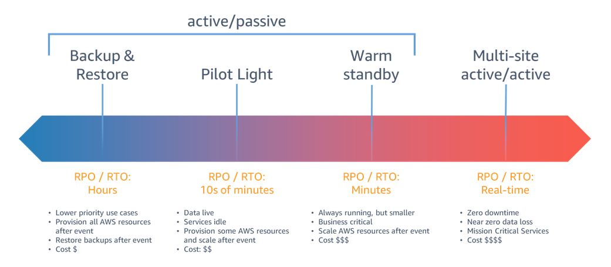

### RDS Multi AZ & Disaster Recovery

When we enable "Multi-AZ deployment" on a Database configuration, in the background Amazon creates two DB instances:

1. Primary DB
2. Standby DB 

in two different availability zones, like below:

Applications does NOT directly track Primary or Standby DB instances, it connects to RDS endpoint.

RDS endpoint remains same, even if there is a primay DB instance failure. This will protect RDS instance in case of a Zone failure, even AZ-1 fails now our Apps is safe , it is still can access the DB that is the one in AZ-2.

#### What if the region itself fails?

There are two options to recover the DB:

1. RDS Backups
    - Snapshots can be created and used in case of any RDS failure in the region.
    - Side effect: If you take a snapshot in t1 and failure occurs in t1 + t2 then you will loose t2 time data.
2. Read Replicas

  - In case the RDS fails in Region-1:
    - Application needs to use the RDS endpoints that connect to Read Replica
    - We need to promote Read Replica to Master DB to accept  instert/delete all requests.
      - When you promote Read Replica, it breaks the relationship between the primary DB and the secondary.
    - Because of the asyncronization replication, we will not loose any data.

##### Disaster Recovery Strategies

Resource: https://docs.aws.amazon.com/whitepapers/latest/disaster-recovery-workloads-on-aws/disaster-recovery-options-in-the-cloud.html

### Best Practices

1- When creating a read replica, try to keep the same instance class and storage class as your primary database so that it becomes easier for you to manage. (5*)

i.e. if the primary db is db.r5.2xlarge then use this in the read replica as well.

2- On CloudWatch, it is important to monitor the following metrics: (5*)
   
   - ReplicaLag
   - NetworkTransmitThroughput
   - NetworkReceiveThroughput
   - WriteThroughput
   - WriteLatency
   - WriteIOPS

3- It is recommended you use a different account per Region to provide the highest level of resource and security isolation (in the case compromised credentials are part of your disaster recovery plans as well). (7*)

### Code

1. To create a RDS using terraform -> [rds.tf](terraform-code/launch-rds/rds.tf)  (6*)

2. To implement multi-region data replication for disaster recovery with AWS RDS and DMS with Terraform -> [rds-dr.tf](terraform-code/multi-region-dr/rds-dr.tf) (9*)

### References

1* https://docs.aws.amazon.com/prescriptive-guidance/latest/dr-standard-edition-amazon-rds/sites-strategies.html

2* [RDS Setting Up Database Disaster Recovery | RDS Multi AZ | RDS Read Replica | RDS Copy Snapshots - Java Home Cloud](https://www.youtube.com/watch?v=fPMAmCBNdJ8)

3* https://d1.awsstatic.com/rdsImages/IG1_RDS1_AvailabilityDurability_Final.pdf

4* [“Multi-AZ” in Amazon RDS and how it may differ from High Availability - Franck Pachot](https://dev.to/aws-heroes/multi-az-in-amazon-rds-and-how-it-differs-from-high-availability-gn9)

5* [Designing a DR strategy on Amazon RDS for SQL Server](https://www.youtube.com/watch?v=GxUZHmtlHew&t=17s)

6* https://github.com/azeezsalu/terraform-tutorial-reference-files/blob/main/rds-refference.tf

7* https://docs.aws.amazon.com/whitepapers/latest/disaster-recovery-workloads-on-aws/disaster-recovery-options-in-the-cloud.html#warm-standby

8* [AWS Disaster Recovery Strategies – PoC with Terraform - Martin Perez Rodriguez](https://xebia.com/blog/aws-disaster-recovery-strategies-poc-with-terraform/)

9* [Implementing multi-region data replication for disaster recovery with AWS RDS and DMS with Terraform](https://www.pulumi.com/ai/answers/1cuRcVri6sdq8PqQtjT2Yj/disaster-recovery-on-aws-with-rds-and-dms)