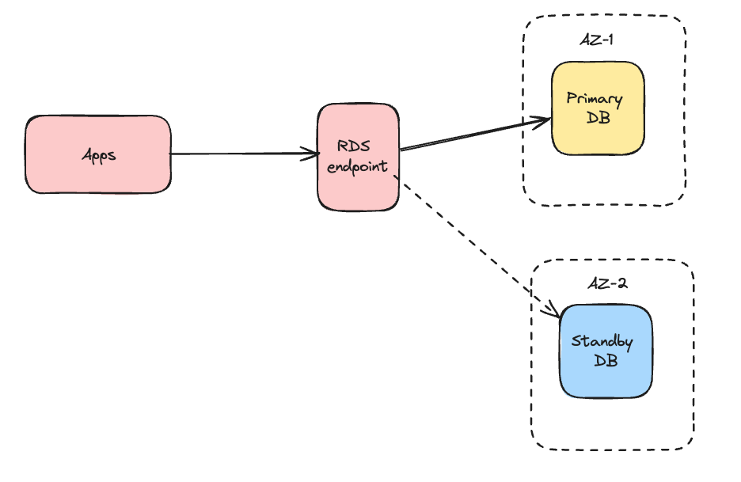
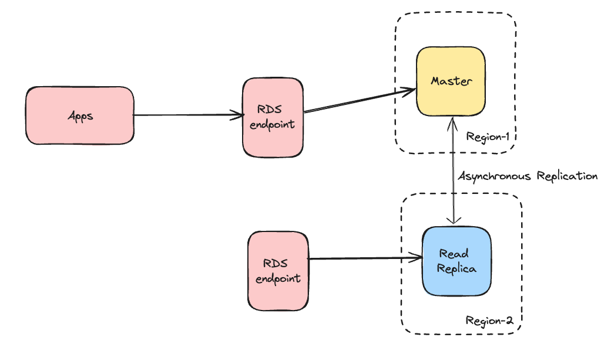

### RDS Multi AZ & Disaster Recovery

When we enable "Multi-AZ deployment" on a Database configuration, in the background Amazon creates two DB instances:

1. Primary DB
2. Standby DB 

in two different availability zones, like below:

Applications does NOT directly track Primary or Standby DB instances, it connects to RDS endpoint.

RDS endpoint remains same, even if there is a primay DB instance failure. This will protect RDS instance in case of a Zone failure, even AZ-1 fails now our Apps is safe , it is still can access the DB that is the one in AZ-2.

#### What if the region itself fails?

There are two options to recover the DB:

1. RDS Backups
    - Snapshots can be created and used in case of any RDS failure in the region.
    - Side effect: If you take a snapshot in t1 and failure occurs in t1 + t2 then you will loose t2 time data.
2. Read Replicas

  - In case the RDS fails in Region-1:
    - Application needs to use the RDS endpoints that connect to Read Replica
    - We need to promote Read Replica to Master DB to accept  instert/delete all requests.
    - Because of the asyncronization replication, we will not loose any data.

### References

1. https://docs.aws.amazon.com/prescriptive-guidance/latest/dr-standard-edition-amazon-rds/sites-strategies.html

2. [RDS Setting Up Database Disaster Recovery | RDS Multi AZ | RDS Read Replica | RDS Copy Snapshots - Java Home Cloud](https://www.youtube.com/watch?v=fPMAmCBNdJ8)

3. https://d1.awsstatic.com/rdsImages/IG1_RDS1_AvailabilityDurability_Final.pdf

4. [“Multi-AZ” in Amazon RDS and how it may differ from High Availability - Franck Pachot](https://dev.to/aws-heroes/multi-az-in-amazon-rds-and-how-it-differs-from-high-availability-gn9)
